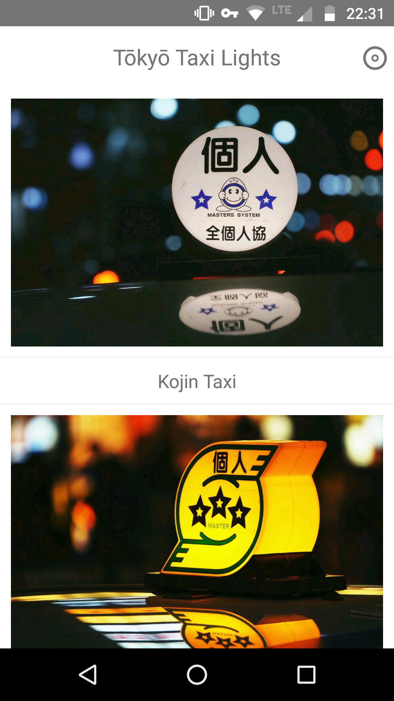

# Tōkyō Taxi Lights

 Tōkyō Taxi Lights is an Android app powered by [Jasonette](https://jasonette.com/). It's a one-trick pony that shows five random photos every time you launch it.
 
 
 
 The app was built to learn Jasonette's basics and to showcase best Tōkyō taxi lights photos taken by yours truly.

## Build Your Own App

The first step is to download and install [Android Studio](https://developer.android.com/studio/index.html) on your machine. To do this on openSUSE, run the following commands:

```
sudo mv android-studio-xx-xxx-xxx.zip /opt
cd /opt
sudo unzip android-studio-xx-xxx-xxx.zip
sudo chown -R root:root android-studio
sudo ln -s /opt/android-studio/bin/studio.sh /usr/local/bin/android-studio
```

To host the PHP script and photos, you need a web server with PHP. To keep things tidy, create a dedicated directory (e.g., *app*) in the document root of the server for storing photos and the script. Before you add photos to this directory, it's a good idea to reduce their size. This will make your app run faster and reduce the amount of data that needs to be transferred. You can use the [jpeg-recompress](https://github.com/danielgtaylor/jpeg-archive) and mogrify tools to do this. With these two tools installed on your system, you can use the following command to recompress or resize all *.jpg* files in the current directory:

```
for file in *.jpg; do jpeg-recompress --quality high $file $file; done
mogrify -resize "1600>" *.jpg
```
Upload then the processed photos to the *app* directory on your web server.

If you have Git installed on your system, clone the [jasonette-tokyo-taxi](https://gitlab.com/dmpop/jasonette-tokyo-taxi) repository using the `git clone https://gitlab.com/dmpop/jasonette-tokyo-taxi.git` command. Alternatively, you can get the source code directly from the project's website as an archive in the format of your choice. Switch to the resulting *jasonette-tokyo-taxi* directory, and open the *json.php* file in a text editor. In the *User-defined values* section, edit the default values. Save the changes and copy the file to the *app* directory on your web server.

Use the `git clone https://github.com/Jasonette/JASONETTE-Android.git` command to clone the *JASONETTE-Android* app's source code. Launch Android Studio by running the `android-studio` command in the terminal, and import the *JASONETTE-Android* project. Open the **app &rarr; res &rarr; values &rarr; strings.xml** file, locate the `<string name="app_name">Jasonette</string>` line and replace *Jasonette* with the desired name. Replace then the default URL in the `string name="url">https://jasonette.github.io/Jasonpedia/hello.json</string>` line with the actual URL to your JSON file. Next, prepare an image file in the PNG format for use as an app icon. In Android Studio, right-click on the **app &rarr; res** folder and choose **New &rarr; Image Asset**. Use a PNG file to create and add an app icon.

Open the **Gradle Scripts &rarr; build.gradle(Module:app)** file, locate the `applicationId "com.jasonette."` line, and replace *com.jasonette* with the desired app ID. Press the **Sync Now** link to synchronize the changes. Now, choose **Build &rarr; Build APK(s)** to build the app.

To install the resulting *app-debug.apk* package on an Android device, switch to **Settings &rarr; Security** and enable the **Unknown Sources** option.
